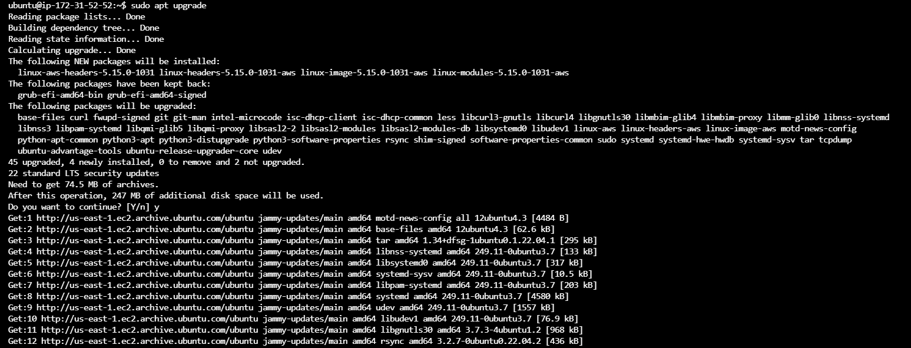
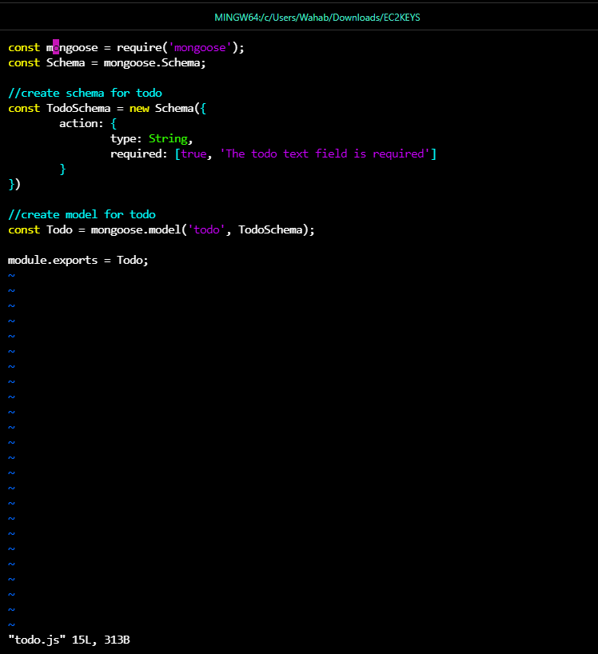
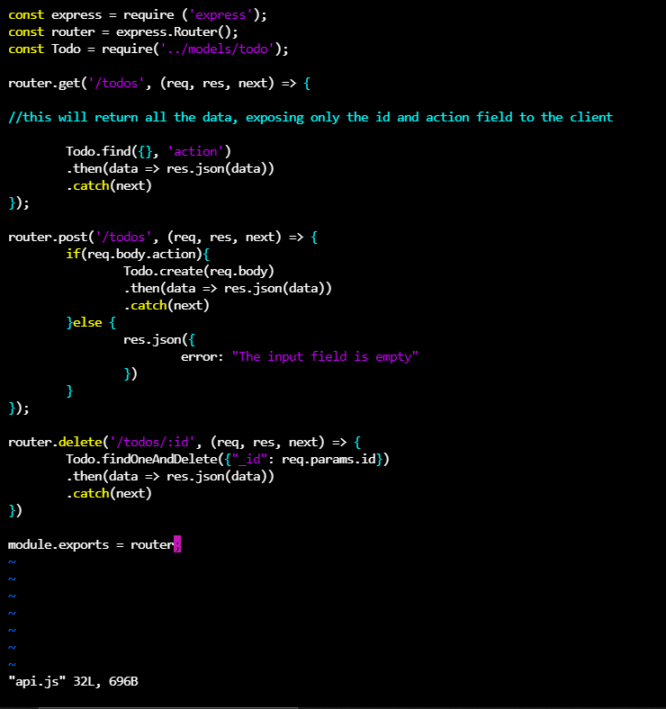

# PROJECT DOCUMENTATION

## Step 1: BACKEND CONFIGURATION

#### Command: sudo apt update (update ubuntu packages)
#### Output:

#### Command: sudo apt upgrade (upgrade ubuntu)
#### Output:

#### Command: curl -fsSL https://deb.nodesource.com/setup_18.x | sudo -E bash - (getting node.js location from ubuntu)
#### Output:

#### Command: sudo apt-get install -y nodejs (installing node and npm and confirming version installed)
#### Output:

#### Command: npm init (Todo App project initialization and creation of packages.json file)
#### Output:

## EXPRESSJS INSTALLATION

#### Command: npm install express

#### Output:

#### Command: npm install dotenv

#### Output:

#### Command: node index.js

#### Output:

#### Command: http://54.84.63.43:5000/

#### Output:

#### Command: mkdir routes and touch api.js (create routes directory and api.js file)

#### Output:

## MODELS

#### Command: npm install mongoose and mkdir models (install mongoose and create models directory)

#### Output:

## MONGODB DATABASE

#### Command: create a mongoDB Database and collection

#### Output:

### Create .env file

### Update index.js file

### Start Server

### POSTMAN (consuming all endpoint API)

#### POST REQUEST

#### GET REQUEST

#### BROWSER OUTPUT

#### DELETE REQUEST

#### BROWSER OUTPUT AFTER DELETE REQUEST

## STEP 2: FRONT END CREATION

#### SCARFFOLDING REACT APP

#### Installing dependencies such as concurrently and nodemon 

#### Update Package.json

#### Update Package.json in Client
#### Add "proxy": "http://localhost:5000" for react port.

#### Run and Start the REACT App

#### Command npm run dev

#### Checking The REACT APP on BROWSER via IP in port 3000

## REACT COMPONENT

## Axios Installation

#### Second COMPONENT

#### Third COMPONENT

#### Updating files in the SRC directory

## TO-DO APP OUTPUT

#### VIEWING ALL TASKS

#### NEW TASKS CREATED

#### A TASK DELETED

